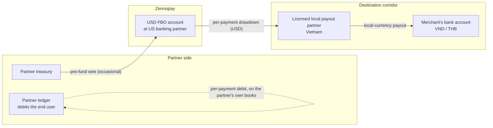

Zennopay operates in **USD only**. We never hold THB or VND. Local-currency
conversion happens inside our licensed payout partner network for the
destination corridor.

## Custody posture

- Partner funds are held in a **For-Benefit-Of (FBO) account** at Zennopay's
  US banking partner. The funds remain attributable to the partner — and
  beneficially to the partner's end users — at all times.
- Zennopay is a US-registered Money Services Business (MSB), operating as a
  **payment facilitator (agent of payee)**.
- Zennopay is **not** an e-money institution. Partner FBO funds are never
  co-mingled with Zennopay operating funds.
- We are USD-only. All FX happens inside the payout partner network for the
  destination corridor.

## The shape of the flow

Money moves in two independent rhythms: the partner **pre-funds** its FBO
balance occasionally (a wire), and each payment **draws down** that balance —
there is no per-transaction money movement between the partner and Zennopay.

- The **pre-fund wire** lands in the partner's FBO balance; deposits and the
  running balance are visible in the Zennopay Console.
- Each captured payment **draws down** the pre-funded balance by the USD
  amount (plus margin); the local-currency payout to the merchant's bank rides
  the corridor's local rails through Zennopay's licensed payout partners.
- The partner debits its end user on **its own ledger**, in parallel. Zennopay
  never touches the partner's user balances.
- Zennopay automatically enforces the corridor's
  [per-user regulatory limits](/fundamentals/limits) at
  confirm time (Vietnam: ₫5,000,000 per transaction, ₫10,000,000 per day,
  ₫25,000,000 per month). Partners build nothing for this — the
  [PaymentSheet](/payments/overview) renders the limit copy when a payment is
  blocked.

## How a payment moves

For a payment in the Thailand corridor (`th_promptpay`):

1. The end user authorizes a USD amount in the partner app; their partner-app
   wallet balance decreases by that amount.
2. Zennopay debits the partner's pre-funded USD float for the authorized
   amount plus Zennopay's transparent processing margin.
3. Zennopay routes the USD downstream to its licensed payout partner for the
   corridor, which performs the USD → local-currency FX.
4. The merchant receives the local-currency equivalent (THB for TH, VND for
   VN) in their QR-registered account.

The same shape applies to Vietnam (`vn_vietqr`), settling in VND.

<Note>
  Zennopay's processing margin is disclosed to each partner in their
  commercial agreement and itemized on monthly statements. It is not exposed
  in the API.
</Note>

## When things fail

| Scenario | What happens to funds |
|---|---|
| Partner auth declines before debit | Nothing moves. The intent is logged as `failed`. |
| Payout partner returns failure after the USD debit | The debit is reversed. No margin recognized. |
| Payout-partner success, then settlement later reported failed | Full reversal: the partner's float is restored, no margin recognized. The intent ends in `failed` and we emit a `payment_intent.failed` webhook. |
| User-initiated refund within the corridor's refund window (T+7 for TH, T+1 for VN) | The downstream payout partner refunds the merchant; Zennopay reverses the margin and credits the partner's float. |
| Refund requested after the corridor's refund window | The payout partner rejects the refund. Resolution is handled commercially between the partner and end user. |

## Pre-funding

Partners maintain a pre-funded USD float with Zennopay. Zennopay monitors
float levels and notifies the partner before a top-up is required, so a
partner in good standing does not run out of float mid-day.

## What you receive as a partner

- A **monthly statement** showing transaction count, gross TPV, processing
  margin, and any commitment-fee passthroughs.
- A **reconciliation report** per corridor, comparing Zennopay's records
  against the downstream settlement record.
- A **monthly invoice** for any commitment fees due.

See [Settlement & reconciliation](/concepts/settlement) for cadence and
reporting.
