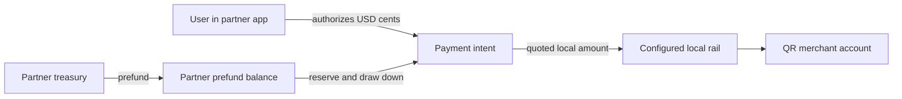

This page describes the QR Payments money flow. Platform Payouts uses a
separate beneficiary and payout contract; see
[Platform Payouts](/platform-payouts/overview).

## The flow

```mermaid
flowchart LR
    Treasury[Partner treasury] -->|prefund| Balance[Partner prefund balance]
    User[User in partner app] -->|authorizes USD cents| Intent[Payment intent]
    Balance -->|reserve and draw down| Intent
    Intent -->|quoted local amount| Rail[Configured local rail]
    Rail --> Merchant[QR merchant account]
```

Prefunding and individual payments happen at different times. Your treasury
funds the environment-scoped balance before users transact. Each confirmed
payment then reserves and draws down the amount required by its bound quote.

## What each amount means

- `amount_usd_cents` is the integer amount authorized from the user's wallet.
- The scanned QR and quote bind the merchant destination and local amount.
- Local amounts use base-10 int64 strings. VND has no fractional minor unit.

See the [Payment Intent API](/api-reference/payment-intents/create) for field
definitions and [QR Payments corridors](/concepts/corridors) for scheme and
currency availability.

## Failure and recovery

No money moves before confirm. After confirm begins, delivery is asynchronous
and may remain unresolved after the HTTP request ends. Do not infer failure
from a timeout and do not create a replacement intent blindly. Read the
existing intent and process its signed webhook events idempotently.

The status contract belongs to the
[payment-intent status reference](/api-reference/payment-intents/get). Shared
retry and reconciliation guidance lives in
[Reconciliation](/concepts/settlement).
