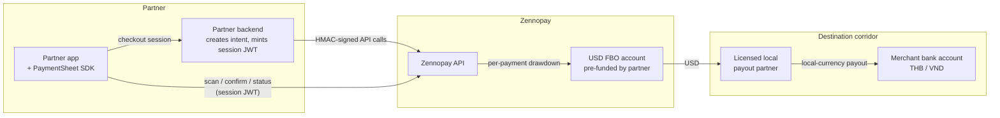

Zennopay sits between a partner fintech's USD wallet and Southeast Asian QR
rails. The partner pre-funds a USD balance; each payment draws it down, and a
licensed local payout partner delivers local currency to the merchant. The
partner app never leaves the foreground — the whole pay experience is the
native [PaymentSheet](/payments/overview).

Three things to hold onto:

1. **Two auth layers.** Your backend signs API calls with a long-lived HMAC
   secret; your app holds only a short-lived, single-intent session JWT.
   See [Authentication](/authentication).
2. **USD-only custody.** Partner funds sit in a For-Benefit-Of account at
   Zennopay's US banking partner; all FX happens downstream in the payout
   partner network. See [Funds flow](/concepts/funds-flow).
3. **Corridors are locked at intent creation.** Thailand PromptPay
   (`th_promptpay`) and Vietnam VietQR (`vn_vietqr`) are live, each with
   [per-user limits](/fundamentals/limits) Zennopay enforces for you.
   See [Corridors](/concepts/corridors).

## Go deeper

<CardGroup cols={2}>
  <Card title="Make a payment" icon="qrcode" href="/payments/overview">
    The PaymentSheet: one call in, one PaymentResult out.
  </Card>
  <Card title="Build your session endpoint" icon="server" href="/payments/session-endpoint">
    The one backend route every payment starts with.
  </Card>
  <Card title="Funds flow" icon="money-bill-transfer" href="/concepts/funds-flow">
    Pre-fund → FBO → drawdown → local-rail payout.
  </Card>
  <Card title="Settlement &amp; reconciliation" icon="scale-balanced" href="/concepts/settlement">
    Daily cycle, reports, and the audit trail.
  </Card>
</CardGroup>
