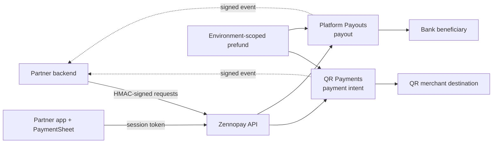

Zennopay exposes two products through the same authenticated API foundation.
They share HMAC signing, sandbox/live isolation, prefunded balances, durable
execution, and signed webhooks. Their users, resources, and delivery contracts
are different.

| | QR Payments | Platform Payouts |
|---|---|---|
| Starts from | A user scanning a merchant QR | Your backend requesting a transfer |
| Primary resource | `payment_intent` | `payout` |
| Destination | Merchant encoded in the QR | Stored or inline beneficiary |
| Client surface | Native PaymentSheet SDK | Server-to-server API |
| Money contract | USD cents plus quoted local minor units | Int64 strings in the payout currency |
| Completion | Payment-intent status and webhook | Payout status and webhook |

```mermaid
flowchart LR
    Partner[Partner backend] -->|HMAC-signed requests| API[Zennopay API]
    App[Partner app + PaymentSheet] -->|session token| API
    API --> QR[QR Payments<br/>payment intent]
    API --> PP[Platform Payouts<br/>payout]
    QR --> Merchant[QR merchant destination]
    PP --> Beneficiary[Bank beneficiary]
    Prefund[Environment-scoped prefund] --> QR
    Prefund --> PP
    QR -. signed event .-> Partner
    PP -. signed event .-> Partner
```

## Shared foundation

- **Authentication:** your backend signs requests with HMAC. Only QR Payments
  gives the mobile SDK a short-lived session token.
- **Isolation:** credentials, resources, balances, and routes are separated
  between sandbox and live environments.
- **Durability:** accepted money movement is persisted before an external rail
  is called.
- **Reconciliation:** resource IDs, partner references, status reads, and
  signed webhook events let your backend recover from timeouts and duplicates.

## Choose a product

<CardGroup cols={2}>
  <Card title="QR Payments" icon="qrcode" href="/qr-payments/overview">
    Add a native scan-and-pay checkout to a mobile app.
  </Card>
  <Card title="Platform Payouts" icon="money-bill-transfer" href="/platform-payouts/overview">
    Send asynchronous bank transfers to beneficiaries from your backend.
  </Card>
  <Card title="Authentication" icon="key" href="/authentication">
    Implement the shared server-to-server signing contract once.
  </Card>
  <Card title="Reconciliation" icon="scale-balanced" href="/concepts/settlement">
    Handle retries, webhooks, and authoritative status reads.
  </Card>
</CardGroup>
