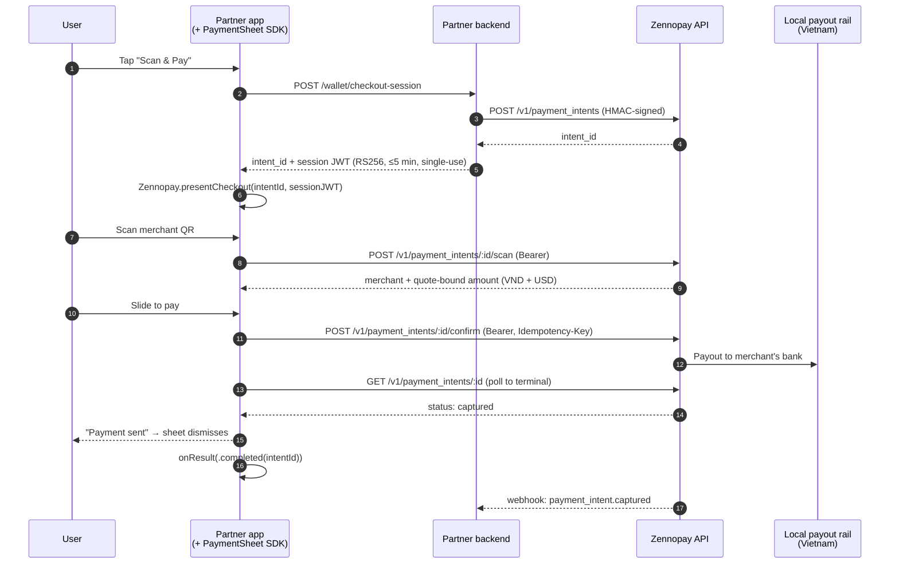

The **PaymentSheet** is Zennopay's prebuilt, native payment UI, modeled on
Stripe's PaymentSheet. Your backend creates a payment intent and mints a
short-lived session token; your app hands both to the SDK in a single call; the
SDK renders the entire pay experience — QR scan, amount + FX quote,
slide-to-pay, and result — **natively, in-process**, and returns one typed
`PaymentResult`.

There is no browser tab, no redirect, and no URL scheme. The camera scanner,
slide-to-pay physics, quote refresh, retries, and status polling are all inside
the sheet.

<Frame caption="One payment, end to end, in the sample wallet app — all rendered by the SDK.">
  
</Frame>

## The flow, screen by screen

These are real captures from the [sample wallet app](#sample-app) paying a VietQR
merchant in the sandbox.

<Steps>
  <Step title="Your app: the user taps Scan &amp; Pay">
    <Frame caption="The partner app owns everything up to this point — wallet, balance, entry point.">
      
    </Frame>
  </Step>
  <Step title="PaymentSheet: scan the merchant QR">
    <Frame caption="Native camera scanner with torch, gallery, and paste-QR fallbacks. The raw payload is validated server-side.">
      
    </Frame>
  </Step>
  <Step title="PaymentSheet: amount + FX quote">
    <Frame caption="₫3,500,000 to the merchant, $140.00 from the user's wallet. Quotes refresh silently on expiry.">
      
    </Frame>
  </Step>
  <Step title="PaymentSheet: slide to pay → result">
    <Frame caption="Slide-to-pay fires the confirm exactly once; the sheet polls to a terminal state and shows a shareable receipt.">
      
    </Frame>
  </Step>
  <Step title="Your app: back in control">
    <Frame caption="The sheet dismisses and your onResult callback fires — debit your ledger, render the activity row.">
      
    </Frame>
  </Step>
</Steps>

## Pick your platform

| Platform | Package | Install | Minimums |
|---|---|---|---|
| [iOS](/payments/ios) | `Zennopay` (SwiftPM / CocoaPods) | SPM `zennopay-ios-sdk` · `pod 'Zennopay'` | iOS 16, Swift 5.9 |
| [Android](/payments/android) | `in.zennopay:sdk` (Maven Central) | `implementation("in.zennopay:sdk:0.6.0")` | minSdk 24, Compose |
| [Flutter](/payments/flutter) | `zennopay_flutter` (pub.dev) | `zennopay_flutter: ^0.6.0` | Flutter 3.19, Dart 3.4 |
| [React Native](/payments/react-native) | `@zennopay/react-native` (npm) | `npm install @zennopay/react-native` | RN 0.70 (bridges the native SDKs) |

Every platform has the same shape: one `present` call in, one `PaymentResult`
out — `completed` / `canceled` / `failed` / `pending` (delivered when the user
leaves while the payout is still processing, or when polling times out; the
payment resolves asynchronously and unspent funds are released automatically).

## How it works

Per payment, your backend does two things — creates the intent
(server-to-server, HMAC-signed with your secret key) and mints a short-lived
**session token** (an RS256 JWT bound to that intent). Your app passes both to
the SDK; the SDK talks to the Zennopay API directly with the session token as
`Authorization: Bearer`.

The session token setup — creating the intent and minting the JWT — is the only
backend work. It is documented end to end, with a complete Node.js reference
implementation, in [Build your session endpoint](/payments/session-endpoint).

<Info>
  **Trust model.** Your **publishable key** (`pk_...`) identifies your app and
  is safe to ship in a binary. Your **secret key** (`sk_...`) signs
  server-to-server calls and never leaves your backend. The session JWT the SDK
  holds is scoped to a single intent, expires in ≤ 5 minutes, and its `sub` is
  your opaque user ID — never a raw government ID. Both keys come from the
  Zennopay Console → **Developers** tab.
</Info>

## What you don't build

The SDK owns the entire payment surface, so you never build:

- **A QR scanner** — camera capture, torch, gallery import, and a paste-QR
  fallback (which also makes the flow testable on simulators).
- **EMVCo parsing** — the raw payload is validated authoritatively server-side
  (CRC, tags, merchant extraction). VietQR today, PromptPay next.
- **FX quoting UI** — the sheet shows the bound local amount and the exact USD
  wallet debit, and silently re-quotes when a quote expires.
- **A confirm surface** — slide-to-pay fires the confirm exactly once, with an
  idempotency key persisted before the network call.
- **Status polling, retries, and recovery** — including re-minting an expired
  session via your `refreshSession` hook and recovering the true terminal
  state after a process death mid-confirm. Slow payouts get a processing
  state with honest copy, a "taking longer than usual" escalation, and a
  `pending` result if the user leaves early:

  <Frame caption="Payouts are asynchronous. The sheet says so instead of spinning silently, and the user can safely leave.">
    
  </Frame>
- **Per-user regulatory limits** — Zennopay enforces
  [corridor limits](/fundamentals/limits) automatically (Vietnam: ₫5,000,000
  per transaction, ₫10,000,000 per day, ₫25,000,000 per month per user) and
  the sheet renders the right copy.
- **New corridors** — when a corridor lights up (Thailand PromptPay is next),
  existing integrations get it with zero client work.
- **The receipt surface** — you keep your own transaction-history list, but you
  never build the authoritative receipt view. When a user taps a past payment,
  [`presentReceipt`](/payments/reopen-receipt) reopens the branded Zennopay
  receipt with its *live* status (pending, captured, failed, or refunded).

## Sample app

The screenshots above come from the Zennopay sample wallet app — a reference
integration that exercises the [session endpoint contract](/payments/session-endpoint)
and the `presentCheckout` call against the sandbox. Ask your Zennopay
integration engineer for the sample project.

## Migrating from hosted checkout (beta)

<Warning>
  The beta hosted-checkout model — a browser tab via
  `ASWebAuthenticationSession` / Chrome Custom Tabs with a URL-scheme redirect —
  is **deprecated and removed**. `Zennopay.openCheckout(...)` and the
  registered URL scheme are gone. Replace the call with
  `presentCheckout` / `presentSheet`, delete your URL-scheme registration, and
  add the camera usage declaration. See the migration notes at the top of the
  [iOS](/payments/ios) and [Android](/payments/android) pages.
</Warning>

## Next steps

<CardGroup cols={2}>
  <Card title="iOS" icon="apple" href="/payments/ios" />
  <Card title="Android" icon="android" href="/payments/android" />
  <Card title="Flutter" icon="mobile" href="/payments/flutter" />
  <Card title="React Native" icon="react" href="/payments/react-native" />
  <Card title="Build your session endpoint" icon="server" href="/payments/session-endpoint">
    The one backend route every payment starts with.
  </Card>
  <Card title="Reopen a receipt" icon="receipt" href="/payments/reopen-receipt">
    You keep your history list; the SDK reopens the authoritative receipt.
  </Card>
  <Card title="Test your integration" icon="vial" href="/payments/testing">
    The sandbox loops to run before release.
  </Card>
</CardGroup>
