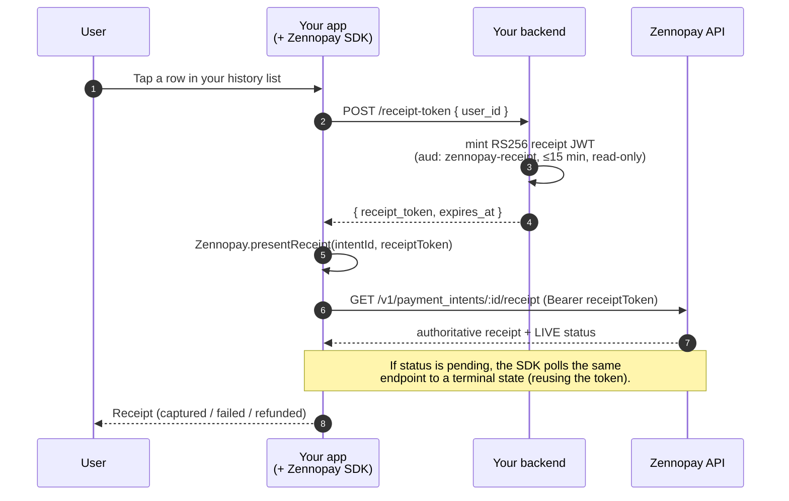

Your app already keeps its own transaction history: you consume
[`GET /v1/transactions`](/api-reference/overview) (or your own ledger) and
render the list your way. What you don't have to build is the **receipt** — the
authoritative, branded detail view for a single past payment, with its *live*
status (still pending, captured, failed, or refunded).

When a user taps a history row, mint a short-lived **receipt token** and hand it
to the SDK's `presentReceipt`. The SDK fetches the authoritative receipt from
Zennopay, renders it natively, and — if the payment is still settling — polls it
to a terminal state in place.

<Frame caption="The authoritative Zennopay receipt, reopened from a history row in the sample wallet app.">
  
</Frame>

<Info>
  **You own the list, we own the receipt.** Your history list is yours — cached,
  paginated, styled to your app. The receipt surface is the SDK's: one call
  reopens the same branded receipt your user saw at pay time, but refreshed to
  the payment's current state. No receipt UI, no status mapping, no refund copy
  to build.
</Info>

## The flow



The receipt token is minted **on demand**, only when the user opens a specific
receipt — not ahead of time for the whole list.

## The receipt token

A receipt token is a **distinct credential** from the
[session JWT](/payments/session-endpoint) you mint to *make* a payment. You sign
it with the **same RS256 private key** (Zennopay verifies both against your
[JWKS](/authentication#jwks-endpoint-requirements)), but its audience, scope, and
lifetime are different: a session JWT authorizes one debit on one intent; a
receipt token only *reads* a receipt.

| Claim | Value |
|---|---|
| `iss` | Your registered issuer URL (same as your session JWTs) |
| `aud` | `"zennopay-receipt"` — **not** `zennopay-checkout` |
| `sub` | The opaque `partner_user_id` whose receipt this is |
| `iat` / `exp` | Now / now + ≤ 900s. Keep it ≤ 15 minutes |

<Note>
  **How a receipt token differs from a session JWT:**

  - **Read-only.** It authorizes `GET /receipt` and nothing else — it can never
    confirm, cancel, or move money.
  - **Reusable.** No single-use `jti`. The SDK reuses the one token to poll a
    pending receipt to its terminal state, so you don't re-mint on every poll.
  - **Not intent-bound.** It carries no `zennopay:intent_id` claim. It's scoped
    to the **user** (`sub`), so the same token can open any of *that user's*
    receipts within its window — but never another user's.
  - **No attestations.** KYC/sanctions claims are a pay-time contract; reopening
    a receipt doesn't move money, so they aren't required.
</Note>

## Mint the receipt token

Add one route to your [session endpoint](/payments/session-endpoint) backend. It
mints an RS256 receipt token scoped to the signed-in user. No dependencies
beyond `node:crypto`.

```ts
import crypto from "node:crypto";
import fs from "node:fs";

const JWT_ISS = "https://api.your-domain.com";            // your registered issuer
const JWT_PRIVATE_PEM = fs.readFileSync("./keys/session_signing_key.pem", "utf8");

function b64url(input: string | Buffer) {
  return Buffer.from(input).toString("base64url");
}

function mintReceiptToken(user: User) {
  const now = Math.floor(Date.now() / 1000);
  const header = { alg: "RS256", kid: "your-rsa-key-1", typ: "JWT" };
  const payload = {
    iss: JWT_ISS,
    aud: "zennopay-receipt",   // NOT zennopay-checkout — read-only receipt scope
    sub: user.id,              // your OPAQUE user id — scopes the token to this user
    iat: now,
    exp: now + 900,            // 15 minutes; reusable within the window
  };
  const signingInput = `${b64url(JSON.stringify(header))}.${b64url(JSON.stringify(payload))}`;
  const signature = crypto
    .createSign("RSA-SHA256")
    .update(signingInput)
    .sign(JWT_PRIVATE_PEM);
  return { token: `${signingInput}.${signature.toString("base64url")}`, expiresAt: payload.exp };
}

// POST /receipt-token — called when the user taps a history row.
app.post("/receipt-token", async (req, res) => {
  const user = await requireAuthedUser(req); // your app auth
  const { token, expiresAt } = mintReceiptToken(user);
  res.json({ receipt_token: token, expires_at: expiresAt });
});
```

<Note>
  The reference [`zennopay-partner-starter`](/payments/session-endpoint#receipt-tokens)
  (v0.1.1+) ships this route as `POST /receipt-token { user_id } → { receipt_token,
  expires_at }`. Use it as the mint reference.
</Note>

## Fetch is the SDK's job

The SDK calls `GET /v1/payment_intents/:id/receipt` with the receipt token as
`Authorization: Bearer`. You usually **don't** call this endpoint yourself —
`presentReceipt` does. It returns the authoritative receipt with a **live**
`status` (`pending`, `captured`, `failed`, or `refunded`) and the branded
receipt fields.

<Warning>
  **Cross-user isolation.** The endpoint returns `404` for an intent that
  doesn't belong to the token's `sub` — another partner's intent, or another of
  your users' intents. It does not distinguish "doesn't exist" from "not yours",
  so it leaks no information about intents outside the current user.
</Warning>

See [`GET /payment_intents/:id/receipt`](/api-reference/payment-intents/receipt)
for the full response shape.

## Present the receipt

Each platform exposes one `presentReceipt` call. Pass the `intentId` from your
history row and the freshly minted `receiptToken`; give it a `refreshReceiptToken`
hook so it can re-mint if the token expires while a slow payout is still being
polled.

<Tabs>
  <Tab title="iOS">
    `Zennopay 0.3.0+`

    ```swift
    import UIKit
    import Zennopay

    func openReceipt(for intentID: String) {
        Task { @MainActor in
            // Mint a receipt token for the signed-in user.
            let tok: ReceiptToken = try await api.post("/receipt-token")

            Zennopay.presentReceipt(
                from: self,
                intentID: intentID,
                receiptToken: tok.receiptToken,
                refreshReceiptToken: { _ in
                    // Called if the token expires while polling a pending
                    // receipt. Re-mint and return a fresh one, or nil.
                    let refreshed: ReceiptToken? = try? await api.post("/receipt-token")
                    return refreshed?.receiptToken
                },
                config: .production,     // .staging in sandbox
                appearance: appearance,  // optional — same theming as the PaymentSheet
                onDismiss: {
                    // The user closed the receipt. Refresh your list row if you like.
                }
            )
        }
    }
    ```
  </Tab>
  <Tab title="Android">
    `in.zennopay:sdk 0.3.0+`

    ```kotlin
    import `in`.zennopay.sdk.Zennopay

    fun openReceipt(activity: ComponentActivity, intentId: String) {
        lifecycleScope.launch {
            val tok = api.post<ReceiptToken>("/receipt-token")

            Zennopay.presentReceipt(
                activity,
                intentId,
                tok.receiptToken,
                refreshReceiptToken = {
                    // Re-mint if the token expires mid-poll; return null to stop.
                    runCatching { api.post<ReceiptToken>("/receipt-token").receiptToken }
                        .getOrNull()
                },
                config = ZennopayConfig.Production,   // .Staging in sandbox
                appearance = appearance,              // optional theming
                onDismiss = { /* user closed the receipt */ },
            )
        }
    }
    ```
  </Tab>
  <Tab title="Flutter">
    `zennopay_flutter`

    ```dart
    import 'package:zennopay_flutter/zennopay_flutter.dart';

    Future<void> openReceipt(String intentId) async {
      final tok = await api.receiptToken(); // POST /receipt-token

      await Zennopay.presentReceipt(
        intentId: intentId,
        receiptToken: tok.receiptToken,
      );
      // Completes when the user closes the receipt.
    }
    ```
  </Tab>
  <Tab title="React Native">
    `@zennopay/react-native`

    ```tsx
    import { presentReceipt } from "@zennopay/react-native";

    async function openReceipt(intentId: string) {
      const { receipt_token } = await api.post("/receipt-token");

      await presentReceipt({ intentId, receiptToken: receipt_token });
      // Resolves when the user closes the receipt.
    }
    ```
  </Tab>
</Tabs>

## What the SDK handles for you

- **Pending → terminal polling.** If the payment is still settling, the receipt
  opens in a processing state and the SDK polls `GET /receipt` (reusing the same
  token) until it reaches `captured` or `failed`, updating the receipt in place.
  A slow payout gets honest copy, not a silent spinner.
- **Refunded state.** A `refunded` receipt renders refund messaging — the amount
  returned and when — instead of a plain success screen, so a user reopening an
  old payment sees the current truth.
- **Cross-user 404.** A token for user A can't open user B's receipt: the
  endpoint returns `404` with no existence leak, and the SDK surfaces a
  not-found state rather than another user's data.
- **Branding.** The receipt honors the same [`ZennopayAppearance`](/payments/ios#customize-appearance)
  you pass to the PaymentSheet, so a reopened receipt matches the one shown at
  pay time.

## Next steps

<CardGroup cols={2}>
  <Card title="Build your session endpoint" icon="server" href="/payments/session-endpoint">
    The receipt-token route lives alongside your session endpoint.
  </Card>
  <Card title="GET /payment_intents/:id/receipt" icon="receipt" href="/api-reference/payment-intents/receipt">
    The authoritative receipt response shape and the no-leak 404.
  </Card>
  <Card title="Webhooks" icon="webhook" href="/api-reference/webhooks">
    Reconcile terminal states server-side, independently of the receipt.
  </Card>
  <Card title="PaymentSheet overview" icon="mobile" href="/payments/overview">
    The pay-time flow the receipt mirrors.
  </Card>
</CardGroup>
