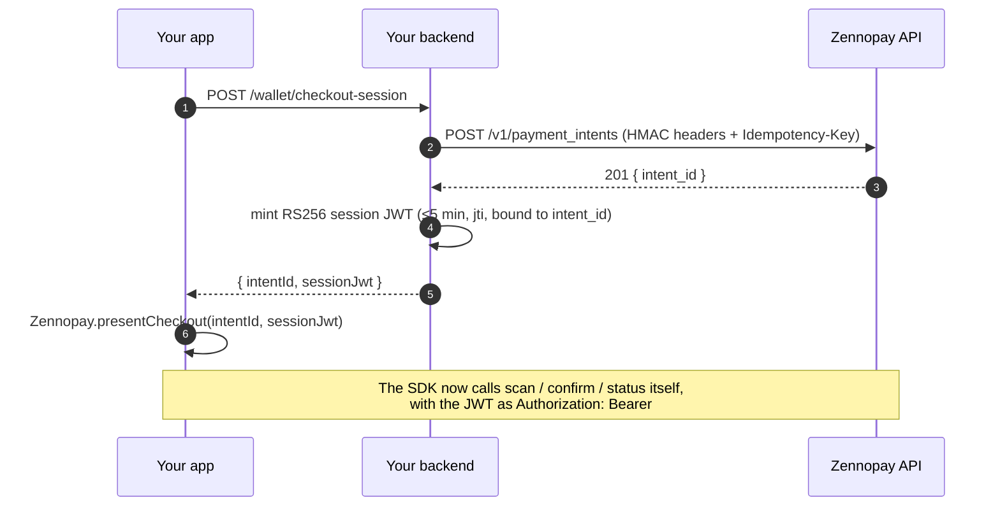

Every [PaymentSheet](/payments/overview) presentation starts with one round-trip to
**your** backend. Your app asks for a "checkout session"; your server does two
things and returns the pair:

1. **Create a payment intent** — a server-to-server call to Zennopay, signed
   with your secret key (HMAC).
2. **Mint a session token** — a short-lived RS256 JWT, signed with your own
   private key, bound to that one intent.



The SDK never sees your keys. It holds only the session token — a credential
scoped to a single intent that dies in five minutes.

## What you need

From the Zennopay Console → **Developers** tab:

| Credential | Lives | Used for |
|---|---|---|
| Publishable key (`pk_test_...` in sandbox; the live-mode key in production) | In your app — safe to ship | Identifies your integration |
| Secret key (`sk_test_...` in sandbox; the live-mode key in production) + key ID | Server only — never in a client | HMAC-signing server-to-server calls |
| Your RS256 keypair | Private key server only; public key published at your [JWKS endpoint](/authentication#jwks-endpoint-requirements) | Signing session JWTs |

## Step 1 — Create the payment intent

`POST /v1/payment_intents`, HMAC-signed (full signing spec:
[Authentication → Server-to-server HMAC](/authentication#server-to-server-hmac)).
The body carries your **opaque** user ID, the authorized USD amount in cents,
and the corridor:

```json
{
  "partner_user_id": "usr_8f3ka92m",
  "amount_usd_cents": 345,
  "corridor": "vn_vietqr"
}
```

<Warning>
  `partner_user_id` must be your internal, opaque identifier — never a raw
  government ID (passport number, national ID). Zennopay enforces
  [per-user regulatory limits](/fundamentals/limits) against this ID
  (Vietnam: ₫5,000,000/transaction, ₫10,000,000/day, ₫25,000,000/month), so
  it must be stable per user.
</Warning>

Send an `Idempotency-Key` header (a UUID) so a network retry can't create two
intents.

## Step 2 — Mint the session token

Sign a JWT with your RS256 **private key**. The claims:

| Claim | Value |
|---|---|
| `iss` | Your registered issuer URL (matches your JWKS registration) |
| `aud` | `"zennopay-checkout"` — always |
| `sub` | The same opaque `partner_user_id` |
| `iat` / `exp` | Now / now + 300s. Keep sessions ≤ 5 minutes — the SDK's `refreshSession` hook handles expiry mid-flow |
| `jti` | A fresh UUID. **Single-use**: consumed by the confirm call, so one token authorizes at most one debit |
| `zennopay:intent_id` | The `intent_id` from step 1 — the token is useless for any other intent |
| `zennopay:amount_usd_cents` | The authorized amount |
| `zennopay:corridor` | Same corridor as the intent |
| `zennopay:kyc_attestation` | `{ verified, method, verified_at, id_type, id_country }` — from your real KYC system |
| `zennopay:sanctions_attestation` | `{ clean, screened_at }` — from your real screening system |

<Note>
  **Why attestations are claims.** You own KYC and sanctions screening for
  your users; Zennopay owns them for merchants. Putting the attestation inside
  the signed token makes the compliance handoff explicit, per-payment, and
  auditable — Zennopay will not move money on a token that doesn't carry them.
  `id_type`/`id_country` declare which government ID your KYC bound this user
  to; the raw ID number itself never crosses.
</Note>

## Reference implementation (Node.js)

A complete Express route, modeled on the reference partner backend. No
dependencies beyond `node:crypto`.

```ts
import crypto from "node:crypto";
import fs from "node:fs";
import express from "express";

const ZENNOPAY_BASE = "https://api.staging.zennopay.in"; // api.zennopay.in in prod
const KEY_ID = process.env.ZENNOPAY_KEY_ID!;              // e.g. "acme_key_001"
const SECRET_KEY = process.env.ZENNOPAY_SECRET_KEY!;      // sk_test_... — server only
const JWT_ISS = "https://api.your-domain.com";            // your registered issuer
const JWT_PRIVATE_PEM = fs.readFileSync("./keys/session_signing_key.pem", "utf8");

// ── HMAC headers for server-to-server calls ─────────────────────────────
// Canonical string: METHOD\npath\ntimestamp\nnonce\nsha256(body)-hex\n
function hmacHeaders(method: string, urlPath: string, body: string) {
  const timestamp = new Date().toISOString();
  const nonce = crypto.randomBytes(32).toString("hex");
  const bodyHashHex =
    body.length === 0
      ? ""
      : crypto.createHash("sha256").update(body, "utf8").digest("hex");
  const canonical =
    [method.toUpperCase(), urlPath, timestamp, nonce, bodyHashHex].join("\n") + "\n";
  const signature = crypto
    .createHmac("sha256", SECRET_KEY)
    .update(canonical, "utf8")
    .digest("base64");
  return {
    "Content-Type": "application/json",
    "X-Zennopay-Key-Id": KEY_ID,
    "X-Zennopay-Timestamp": timestamp,
    "X-Zennopay-Nonce": nonce,
    "X-Zennopay-Signature": signature,
  };
}

// ── Session JWT (RS256) ─────────────────────────────────────────────────
function b64url(input: string | Buffer) {
  return Buffer.from(input).toString("base64url");
}

function mintSessionJwt(intentId: string, user: User, amountUsdCents: number) {
  const now = Math.floor(Date.now() / 1000);
  const header = { alg: "RS256", kid: "your-rsa-key-1", typ: "JWT" };
  const payload = {
    iss: JWT_ISS,
    aud: "zennopay-checkout",
    sub: user.id,                      // your OPAQUE user id — never a gov ID
    jti: crypto.randomUUID(),          // single-use: consumed by confirm
    iat: now,
    exp: now + 300,                    // 5 minutes
    "zennopay:intent_id": intentId,
    "zennopay:amount_usd_cents": amountUsdCents,
    "zennopay:corridor": "vn_vietqr",
    // From YOUR real KYC + sanctions systems — Zennopay trusts these claims.
    "zennopay:kyc_attestation": {
      verified: true,
      method: "your_kyc_v2",
      verified_at: user.kycVerifiedAt,  // ISO 8601
      id_type: "passport",              // which gov ID the user was KYC'd on
      id_country: "IN",
    },
    "zennopay:sanctions_attestation": {
      clean: true,
      screened_at: user.sanctionsScreenedAt,
    },
  };
  const signingInput = `${b64url(JSON.stringify(header))}.${b64url(JSON.stringify(payload))}`;
  const signature = crypto
    .createSign("RSA-SHA256")
    .update(signingInput)
    .sign(JWT_PRIVATE_PEM);
  return `${signingInput}.${signature.toString("base64url")}`;
}

// ── The session endpoint your app calls ─────────────────────────────────
const app = express();
app.use(express.json());

app.post("/wallet/checkout-session", async (req, res) => {
  const user = await requireAuthedUser(req); // your app auth
  const amountUsdCents = authorizeSpend(user, req.body); // your wallet logic

  // 1. Create the intent (HMAC-signed, idempotent).
  const body = JSON.stringify({
    partner_user_id: user.id,
    amount_usd_cents: amountUsdCents,
    corridor: "vn_vietqr",
  });
  const resp = await fetch(`${ZENNOPAY_BASE}/v1/payment_intents`, {
    method: "POST",
    headers: {
      ...hmacHeaders("POST", "/v1/payment_intents", body),
      "Idempotency-Key": crypto.randomUUID(),
    },
    body,
  });
  if (resp.status !== 201) {
    return res.status(502).json({ error: "intent_creation_failed" });
  }
  const { intent_id } = await resp.json();

  // 2. Mint the session token bound to that intent.
  const sessionJwt = mintSessionJwt(intent_id, user, amountUsdCents);

  res.json({ intentId: intent_id, sessionJwt });
});

// ── Refresh: re-mint for the SAME intent (drives the SDK's refreshSession) ──
app.post("/wallet/checkout-session/:intentId/refresh", async (req, res) => {
  const user = await requireAuthedUser(req);
  const { intentId } = req.params;
  assertUserOwnsIntent(user, intentId); // look up your own record of the intent
  const sessionJwt = mintSessionJwt(intentId, user, amountFor(intentId));
  res.json({ intentId, sessionJwt });
});
```

The refresh route is what your app's `refreshSession` hook calls when the SDK
hits a 401 mid-flow: same intent, fresh `jti`, fresh 5-minute window. Zennopay
preserves the scan/quote/confirm state across the refresh.

## Security notes

- **Short-lived, single-use, intent-bound.** If a session token leaks (device
  log, crash report), it authorizes at most one confirm, on one intent, for a
  few minutes — and the SDK never puts it in a URL, so it can't leak via
  history or referrers.
- **Asymmetric on purpose.** Zennopay verifies your JWT against your public
  JWKS — your signing key never leaves your infrastructure, and rotation is
  just publishing a new `kid`.
- **The secret key stays server-side.** Only HMAC-signed, server-to-server
  calls can create intents or move money-adjacent state. The mobile app can
  only do what the session token allows.
- **Mint after auth, not before.** Only mint a session for a user who is
  logged in, KYC-verified, and sanctions-screened *right now* — the
  attestations you sign are per-payment statements, not cached facts.

## Receipt tokens

To let a user **reopen** the authoritative receipt for a *past* payment — its
live status and the Zennopay brand — you mint a second, distinct credential: a
**receipt token**. Same RS256 signing key, different contract.

| | Session JWT | Receipt token |
|---|---|---|
| `aud` | `zennopay-checkout` | `zennopay-receipt` |
| Scope | One intent (`zennopay:intent_id`) | The user (`sub`) — **not** intent-bound |
| Lifetime | ≤ 5 min | ≤ 15 min |
| Use | Single-use (`jti`, consumed by confirm) | **Reusable** — polls a pending receipt |
| Power | Authorizes one debit | **Read-only** — only `GET /receipt` |
| Attestations | Required (KYC + sanctions) | Not required (no money moves) |

Mint one on demand when the user taps a history row. The reference
[`zennopay-partner-starter`](https://github.com/Zennopay/zennopay-partner-starter)
(v0.1.1+) ships the route as `POST /receipt-token { user_id } → { receipt_token,
expires_at }`. The full flow — mint, `presentReceipt`, pending-poll, refunded
state, and the cross-user `404` — is in
[Reopen a receipt](/payments/reopen-receipt).

## Next steps

<CardGroup cols={2}>
  <Card title="Present the PaymentSheet" icon="mobile" href="/payments/overview">
    Hand the session to the SDK on iOS, Android, Flutter, or React Native.
  </Card>
  <Card title="Reopen a receipt" icon="receipt" href="/payments/reopen-receipt">
    Mint a receipt token and reopen the authoritative receipt for a past payment.
  </Card>
  <Card title="Test your integration" icon="vial" href="/payments/testing">
    Drive the whole flow in the sandbox before going live.
  </Card>
  <Card title="Authentication" icon="key" href="/authentication">
    The full HMAC signing spec and JWT claim contract.
  </Card>
  <Card title="Per-user limits" icon="gauge-high" href="/fundamentals/limits">
    The corridor limits enforced against your partner_user_id.
  </Card>
</CardGroup>
