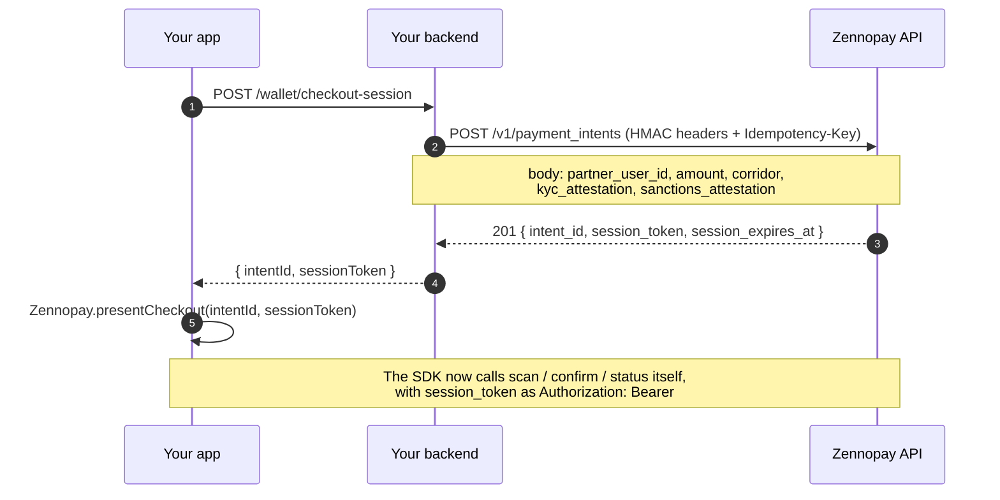

Every [PaymentSheet](/payments/overview) presentation starts with one round-trip
to **your** backend. Your app asks for a "checkout session"; your server makes
one HMAC-signed call to Zennopay and returns the pair the SDK needs.

In the default integration (**Model B**) there is nothing to sign but the API
call itself: you **create a payment intent** server-to-server, and Zennopay
**mints the session token** and returns it in the same response. No RS256 key
pair, no `iss`/`kid`, no JWKS — one credential, the HMAC secret.



The SDK never sees your HMAC secret. It holds only the session token — a
credential Zennopay minted, scoped to a single intent, that expires in a few
minutes.

## What you need

From the Zennopay Console → **Developers** tab:

| Credential | Lives | Used for |
|---|---|---|
| Publishable key (`pk_test_...` in sandbox; the live-mode key in production) | In your app — safe to ship | Identifies your integration |
| Secret key (`sk_test_...` in sandbox; the live-mode key in production) + key ID | Server only — never in a client | HMAC-signing server-to-server calls |

<Note>
  **No signing key pair.** Model B has no partner-held RSA keypair and nothing to
  publish at a JWKS endpoint — Zennopay mints the session token. If you have a
  hard requirement to self-sign your own session tokens, see
  [Advanced: bring-your-own signing key (Model A)](/advanced/self-signed-sessions).
</Note>

## Step 1 — Create the payment intent

`POST /v1/payment_intents`, HMAC-signed (full signing spec:
[Authentication → Server-to-server HMAC](/authentication#server-to-server-hmac)).
The body carries your **opaque** user ID, the authorized USD amount in cents,
the corridor, and your per-payment KYC + sanctions attestations:

```json
{
  "partner_user_id": "usr_8f3ka92m",
  "amount_usd_cents": 345,
  "corridor": "vn_vietqr",
  "kyc_attestation": {
    "verified": true,
    "method": "your_kyc_v2",
    "verified_at": "2026-05-21T13:30:00Z",
    "id_type": "passport",
    "id_country": "IN"
  },
  "sanctions_attestation": {
    "clean": true,
    "screened_at": "2026-05-21T14:25:00Z"
  }
}
```

<Warning>
  `partner_user_id` must be your internal, opaque identifier — never a raw
  government ID (passport number, national ID). Zennopay enforces
  [per-user regulatory limits](/fundamentals/limits) against this ID
  (Vietnam: ₫5,000,000/transaction, ₫10,000,000/day, ₫25,000,000/month), so
  it must be stable per user.
</Warning>

Send an `Idempotency-Key` header (a UUID) so a network retry can't create two
intents.

<Note>
  **Why attestations are in the create body.** You own KYC and sanctions
  screening for your users; Zennopay owns them for merchants. Because Zennopay
  mints the session token, the attestation travels with the signed create call
  — explicit, per-payment, and auditable. Zennopay will not move money on an
  intent that doesn't carry them. `id_type` / `id_country` declare which
  government ID your KYC bound this user to; the raw ID number itself never
  crosses.
</Note>

## Step 2 — Return the session token Zennopay minted

The `201` response carries the session token. There is no minting step on your
side — read it off the response and hand it to your app:

```json
{
  "intent_id": "zp_AbCd1234EfGh5678",
  "status": "created",
  "amount_usd_cents": 345,
  "corridor": "vn_vietqr",
  "session_token": "zpst_9b1f…",
  "session_expires_at": 1716305700,
  "created_at": "2026-05-21T14:30:00Z"
}
```

| Field | Meaning |
|---|---|
| `session_token` | The credential the SDK sends as `Authorization: Bearer`. Opaque to you — pass it through, don't parse it |
| `session_expires_at` | Unix epoch **seconds** at which the token stops verifying. The SDK's `refreshSession` hook re-mints before this matters |

## Reference implementation (Node.js)

A complete Express route, modeled on the reference partner backend
(`zennopay-partner-starter` **v0.2.0+**, HMAC-only). No dependencies beyond
`node:crypto`.

```ts
import crypto from "node:crypto";
import express from "express";

const ZENNOPAY_BASE = process.env.ZENNOPAY_BASE_URL!;   // https://api.sandbox.zennopay.in
const KEY_ID = process.env.ZENNOPAY_HMAC_KEY_ID!;        // e.g. "acme_sandbox_2026q2"
const SECRET = process.env.ZENNOPAY_HMAC_SECRET!;        // <your_secret> — server only

// ── HMAC headers for server-to-server calls ─────────────────────────────
// Canonical string: METHOD\npath\ntimestamp\nnonce\nsha256(body)-hex\n
function hmacHeaders(method: string, urlPath: string, body: string) {
  const timestamp = new Date().toISOString();
  const nonce = crypto.randomBytes(32).toString("hex"); // 64 hex chars
  const bodyHashHex =
    body.length === 0
      ? ""
      : crypto.createHash("sha256").update(body, "utf8").digest("hex");
  const canonical =
    [method.toUpperCase(), urlPath, timestamp, nonce, bodyHashHex].join("\n") + "\n";
  const signature = crypto
    .createHmac("sha256", SECRET)
    .update(canonical, "utf8")
    .digest("base64");
  return {
    "Content-Type": "application/json",
    "X-Zennopay-Key-Id": KEY_ID,
    "X-Zennopay-Timestamp": timestamp,
    "X-Zennopay-Nonce": nonce,
    "X-Zennopay-Signature": signature,
  };
}

// ── The session endpoint your app calls ─────────────────────────────────
const app = express();
app.use(express.json());

app.post("/wallet/checkout-session", async (req, res) => {
  const user = await requireAuthedUser(req);            // your app auth
  const amountUsdCents = authorizeSpend(user, req.body); // your wallet logic

  // Create the intent (HMAC-signed, idempotent). Attestations come from
  // YOUR real KYC + sanctions systems — Zennopay trusts these fields.
  const body = JSON.stringify({
    partner_user_id: user.id,          // your OPAQUE user id — never a gov ID
    amount_usd_cents: amountUsdCents,
    corridor: "vn_vietqr",
    kyc_attestation: {
      verified: true,
      method: "your_kyc_v2",
      verified_at: user.kycVerifiedAt,  // ISO 8601
      id_type: "passport",              // which gov ID the user was KYC'd on
      id_country: "IN",
    },
    sanctions_attestation: {
      clean: true,
      screened_at: user.sanctionsScreenedAt,
    },
  });

  const resp = await fetch(`${ZENNOPAY_BASE}/v1/payment_intents`, {
    method: "POST",
    headers: {
      ...hmacHeaders("POST", "/v1/payment_intents", body),
      "Idempotency-Key": crypto.randomUUID(),
    },
    body,
  });
  if (resp.status !== 201) {
    return res.status(502).json({ error: "intent_creation_failed" });
  }

  // Zennopay minted the session token for us — just pass it through.
  const { intent_id, session_token } = await resp.json();
  res.json({ intentId: intent_id, sessionToken: session_token });
});

// ── Refresh: re-mint the token for the SAME intent ──────────────────────
// Drives the SDK's refreshSession hook. No new intent, no attestations —
// just a fresh session_token for the intent that already exists.
app.post("/wallet/checkout-session/:intentId/refresh", async (req, res) => {
  const user = await requireAuthedUser(req);
  const { intentId } = req.params;
  assertUserOwnsIntent(user, intentId); // look up your own record of the intent

  const path = `/v1/payment_intents/${intentId}/session`;
  const resp = await fetch(`${ZENNOPAY_BASE}${path}`, {
    method: "POST",
    headers: hmacHeaders("POST", path, ""),
  });
  if (resp.status !== 200) {
    return res.status(502).json({ error: "session_remint_failed" });
  }
  const { session_token } = await resp.json();
  res.json({ intentId, sessionToken: session_token });
});
```

The refresh route is what your app's `refreshSession` hook calls when the SDK
hits a 401 mid-flow: same intent, a fresh token from
`POST /v1/payment_intents/:id/session`, fresh expiry window. Zennopay
preserves the scan/quote/confirm state across the re-mint.

## Security notes

- **Short-lived, single-use, intent-bound.** If a session token leaks (device
  log, crash report), it authorizes at most one confirm, on one intent, for a
  few minutes — and the SDK never puts it in a URL, so it can't leak via
  history or referrers.
- **Zennopay-minted.** You never hold a session-signing key, so there's no
  private key to protect, rotate, or leak. The token is opaque to you.
- **The HMAC secret stays server-side.** Only HMAC-signed, server-to-server
  calls can create intents or re-mint tokens. The mobile app can only do what
  the session token allows.
- **Attest after auth, not before.** Only create an intent for a user who is
  logged in, KYC-verified, and sanctions-screened *right now* — the
  attestations you send are per-payment statements, not cached facts.

## Receipt tokens

To let a user **reopen** the authoritative receipt for a *past* payment — its
live status and the Zennopay brand — you fetch a second, distinct credential: a
**receipt token**. Like the session token, Zennopay mints it; you request it
with one more HMAC-signed call.

| | Session token | Receipt token |
|---|---|---|
| Scope | One intent | The user (`partner_user_id`) — **not** intent-bound |
| Lifetime | short (a few min) | ≤ 15 min |
| Use | Single-use (consumed by confirm) | **Reusable** — polls a pending receipt |
| Power | Authorizes one debit | **Read-only** — only `GET /receipt` |
| Minted by | Zennopay, on intent create | Zennopay, on `POST /v1/receipt_tokens` |

Request one on demand when the user taps a history row. The reference
[`zennopay-partner-starter`](https://github.com/Zennopay/zennopay-partner-starter)
(v0.2.0+) ships the route as `POST /receipt-token { user_id } → { receipt_token,
expires_at }`. The full flow — request, `presentReceipt`, pending-poll, refunded
state, and the cross-user `404` — is in
[Reopen a receipt](/payments/reopen-receipt).

## Next steps

<CardGroup cols={2}>
  <Card title="Present the PaymentSheet" icon="mobile" href="/payments/overview">
    Hand the session to the SDK on iOS, Android, Flutter, or React Native.
  </Card>
  <Card title="Reopen a receipt" icon="receipt" href="/payments/reopen-receipt">
    Fetch a receipt token and reopen the authoritative receipt for a past payment.
  </Card>
  <Card title="Test your integration" icon="vial" href="/payments/testing">
    Drive the whole flow in the sandbox before going live.
  </Card>
  <Card title="Authentication" icon="key" href="/authentication">
    The full HMAC signing spec and the session-token contract.
  </Card>
  <Card title="Per-user limits" icon="gauge-high" href="/fundamentals/limits">
    The corridor limits enforced against your partner_user_id.
  </Card>
</CardGroup>
